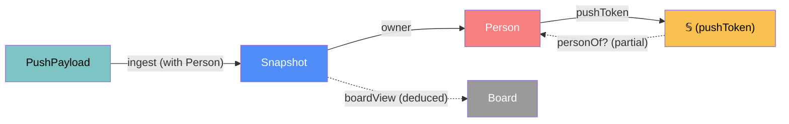

# board — categorical model

> Model-first (FRAMEWORK §2/§4). This is the Cloudflare Worker (L2) plus the single `Board` Durable Object (L3).
> The only stored state in the system is one `Snapshot` per person. Straddles L2/L3 (§7.2).

## 1. Overview
- It accepts pushes (`/push/<token>`) and stores the latest snapshot per person.
- It serves the board JSON (`/api/<view>/board`), the viewer page (`/v/<view>`) and the setup page (`/setup/<view>`).
- Every other path, and any wrong secret, gets a bare 404.
- It never contacts NLB.

## 2. Why
It is client–server (§7.2) with exactly one authoritative `DataLoc` for `Snapshot` (L3). Everything else is deduced, either
on read (`Board`) or at the viewer (overlaps, staleness). Secrets are the single source of truth for `Person` (§5).

## 3. Core category

## 4. Morphism table
| Morphism | Signature | Partiality | Semantics |
| --- | --- | --- | --- |
| `personOf?` | `𝕊 → Person` | Partial | constant-time token match against `PEOPLE[i].pushToken`; undefined → 404 |
| `ingest ⊸` | `Person × NlbRow* → Snapshot` | Partial | the body is an array of ≤ 200 rows → `trim` → `extract` → validate (domain) passes, and the rate limit allows at most 1 per 2 s per person (D35) → **replace** the snapshot (C1), setting `receivedAt = server now` |
| `owner` | `Snapshot → Person` | Total | |
| `boardView` | `Snapshot* × Person* → Board` | Deduced | built on every read; people with no snapshot get an empty lane |
| `buildPushClient` | `Origin × Person → Bookmarklet ⊕ Userscript` | Total | /setup templating (R5.1) |
| `guard` | `Request → Response` | Total | a natural transformation over all routes: adds `X-Robots-Tag: noindex, nofollow, noarchive` and `Referrer-Policy: no-referrer`; unknown path or wrong secret → bare 404 |

## 5. Functors
**Router** `Path → Handler`:
- `/v/:view` → viewer HTML;
- `/api/:view/board` → `boardView`;
- `POST /push/:token` → `ingest`; a form gets a 303 to `/v/:view?pushed=<id>`, JSON gets 204;
- `/setup/:view` → setup HTML;
- `/setup/:view/:person.user.js` → userscript;
- `/robots.txt` → `Disallow: /`;
- anything else → 404.

Note: the push redirect needs the view secret. The Worker knows it, and the push client never sees it.

## 6. Composition rules
1. `invariant`: there is at most one `Snapshot` per `Person`. A later push replaces it, so the later `receivedAt` wins.
2. `invariant`: `Board` and `Overlap`/`Staleness` are never persisted (§5 deduce).
3. `constraint`: no outbound `fetch` exists anywhere in the Worker (the "never contacts NLB" law).
4. `constraint`: secrets compare in constant time. Error bodies reveal nothing.
5. `constraint`: `Person` (id, name, pushToken) comes only from the single secret `PEOPLE` (JSON), and `VIEW_SECRET` is also a secret. Nothing deployment-specific is in `wrangler.toml` or git.

## 7. Atoms owned
**Trn**: `ingest`, `boardView`, `buildPushClient`, `guard`, router (planned).
**Loc**: L2 (Worker isolate), L3 (`Board` DO, SQLite).
**Trm**: `T2` (L2↔L3 RPC); it serves `T3` (→L4) and `T4` (→L1 via the user).
**Placements**: `validatePayload` is placed here (L2) as well as by construction at L1.

## 8. Bridges
| Boundary morphism | Signature | Stored? | Semantics |
| --- | --- | --- | --- |
| `T1`/`T1'` in | `push-client → board` | the snapshot is stored | the push |
| `T3` out | `board → viewer` | no | the `Board` JSON |

## 9. Coherence notes
- Law 2: T2 is a real boundary between the isolate and the DO.
- Law 4: the viewer reads only via T3.
- §7.2 holds: L3 is authoritative and the L4 copy is a render copy.
