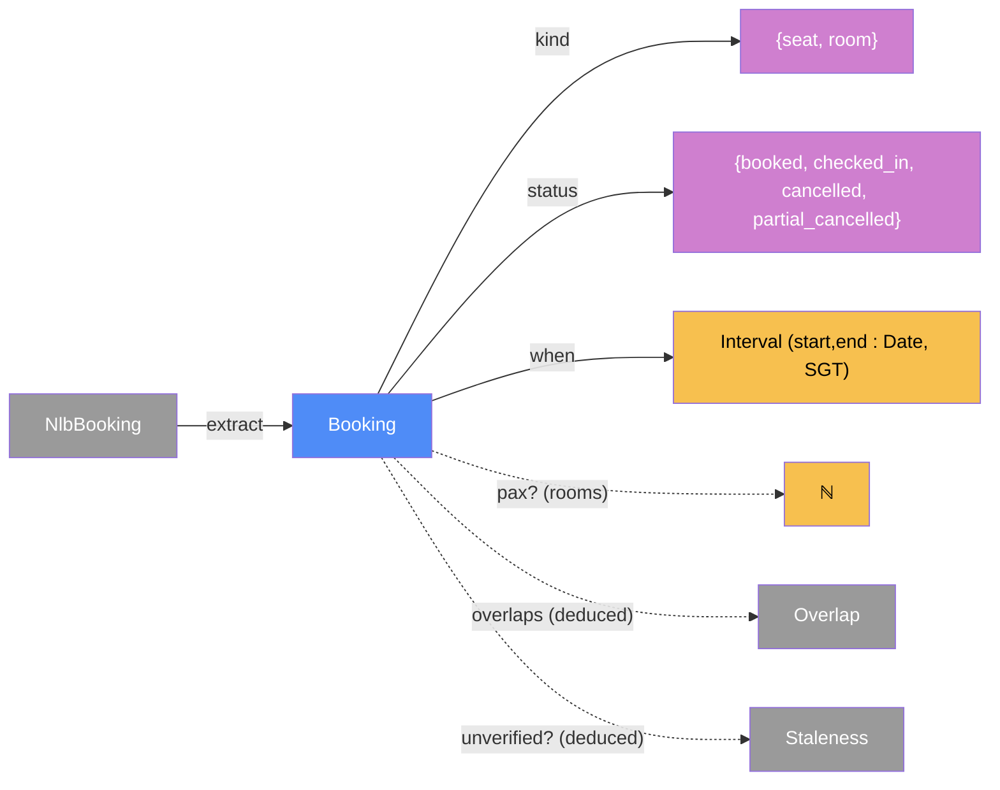

# domain — categorical model

> Model-first (FRAMEWORK §2/§4). This is the intended specification of the pure booking library shared by
> push-client (L1), board (L2, for validation) and viewer (L4). The code realises it (see IMPLEMENTATION.md).
> It is a degenerate §7.1 component: Dat + Alg only, with no Loc/Trm of its own.

## 1. Overview
These are the types and pure functions for one booking concept:
- normalising NLB's raw booking into `Booking`;
- validating a `PushPayload`;
- deducing `Overlap`s and `Staleness`.

It does no I/O and reads no clock. "Now" is always passed in as an argument.

## 2. Why
Seat and room bookings are **one object** (§3): the same morphisms to library, area, time and status,
with a `kind` discriminator and the partial `pax?`. Overlaps and staleness are **deduced** morphisms
over `Board`, so nothing can drift. Placing the same pure `Trn`s at several sites (§4.2) gives
the push side and the server side one source of truth for the schema.

## 3. Core category

## 4. Morphism table
| Morphism | Signature | Partiality | Semantics |
| --- | --- | --- | --- |
| `extract` | `NlbBooking → Booking` | Partial | undefined for visit bookings (R3.4) and unparseable rows, which are dropped |
| `ref` | `Booking → 𝕊` | Total | NLB `bookingRefId` |
| `kind` | `Booking → {seat, room}` | Total | `room` ⟺ `infoJson` parses to an object with `NumberOfPeople` (spike S1: `bookingRefId` is `NLB…S…` for both kinds, so the ref can't discriminate) |
| `mergeBlocks` | `Booking* → Block*` | Deduced | NLB returns one row per hour; consecutive rows with the same unit and status, where `r.start = prev.end`, form one display block |
| `library`, `area`, `floor`, `unit` | `Booking → 𝕊` | Total | `unit` = seat name or room/zone name |
| `when` | `Booking → Interval` | Total | `[start, end)` as ISO strings with +08:00 |
| `pax?` | `Booking → ℕ` | Partial | rooms only |
| `status` | `Booking → Status` | Total | mapped from NLB `actions[]` (see §6, rule 3) |
| `overlaps` | `Board → Overlap*` | Deduced | §6, rule 4 |
| `unverified?` | `Board × Now → Staleness*` | Deduced | §6, rule 5 |
| `validatePayload` | `Json → PushPayload` | Partial | schema + 64 KB cap; undefined on any violation |

## 5. Functors
**Status functor** `actions[] → Status`. It maps NLB's free-form action list onto the discrete category `Status`:
- any of `ManualFullCancel` → `cancelled`;
- else any of `ManualPartialCancel`, `AutoPartialCancel` → `partial_cancelled`;
- else any of `BookAndCheckIn`, `AutoCheckIn`, `ManualCheckIn`, `OverBookAndCheckIn` → `checked_in`;
- else → `booked`.

The mapping is by suffix pattern (`/FullCancel$/`, `/PartialCancel$/`, `/CheckIn$/`), so codes not yet seen, such as an auto-cancel for a no-show, still classify. Anything else (`Book`) → `booked`. Raw codes are kept for display.

## 6. Composition rules
1. `invariant: start < end`, and both carry the +08:00 offset. NLB sends offset-less local times, so `extract` appends +08:00. Rendering is always SGT (C4).
2. `invariant: extract` emits only booking fields. No profile field (name, email, member id) is reachable from `Booking` (R4.4).
3. `deduction: status = statusFunctor ∘ actions`. Precedence is cancel > partial > checked_in > booked.
4. `deduction: overlaps`. Computed on merged `Block`s. For blocks `a` (person A) and `b` (person B ≠ A), both with status ∉ {cancelled} (C3), where `a.when ∩ b.when ≠ ∅` (half-open, so touching intervals do **not** overlap), exactly one `Overlap` is produced per pair:
   - `seat_in_partner_room` (with `redundantSeat`) when one is a seat and the other a room;
   - `duplicate_rooms` when both are rooms;
   - otherwise `both_booked`.
5. `deduction: unverified(b)` ⟺ `b.status = booked` ∧ `now ≥ b.start + 15 min` ∧ `snapshot.receivedAt < b.start + 15 min`. A boundary of exactly start+15 counts as passed (R4.3).
6. `constraint`: ingest validation rejects a body that isn't an array of ≤ 200 rows, and any booking violating rule 1. The Worker enforces the 64 KB cap. The device-time skew rule was removed (D42).

## 7. Atoms owned
**Trn**:
| Trn | t_from → t_to | Realising code |
| --- | --- | --- |
| `extract` | `NlbBooking → Booking` | planned |
| `validatePayload` | `Json → PushPayload` | planned |
| `computeOverlaps` | `Board → Overlap*` | planned |
| `computeStaleness` | `Board × Now → Staleness*` | planned |

**Loc**: none of its own (pure). **Trm**: none.

**Placements**:
- `extract` is placed at L2, in board ingest. It was moved off L1 by D41, the 1 KB bookmarklet budget. Only the `NLB_ROW_KEYS` whitelist constant is placed at L1, in the push clients.
- `validatePayload` is placed at L2.
- `computeOverlaps` and `computeStaleness` are placed at L4.

## 8. Bridges
| Boundary morphism | Signature | Stored? | Semantics |
| --- | --- | --- | --- |
| `board_snapshot` | `board.Snapshot → Booking*` | Stored (L3) | the only stored copy |

## 9. Coherence notes
Law 6 is honoured: the same schema is placed at L1 and L2 on purpose. Law 1 holds because `now` is an explicit input, so no hidden clock read happens.
