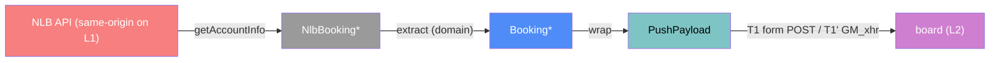

# push-client — categorical model

> Model-first (FRAMEWORK §2/§4). This is the code that runs **on the NLB page in the user's own browser** (L1).
> Two parallel realisations (strategy shape, §4.4) share one contract,
> `NlbBooking* → PushPayload` delivered to L2.

## 1. Overview
It reads the logged-in user's bookings on NLB's page, trims them to `Booking` fields, and pushes the
result to our Worker. There are two realisations:
- **Bookmarklet**: one tap, in Chrome desktop and Android.
- **Userscript**: Violentmonkey/Tampermonkey. It pushes automatically on page load and after Book/Cancel/Extend.

## 2. Why
This is the only component allowed to touch NLB. Making it a separate component, with a single outward port `T1`,
makes the hard constraint "the server never contacts NLB" a structural fact. The diagram contains no other
edge into NLB.

## 3. Core category

## 4. Morphism table
| Morphism | Signature | Partiality | Semantics |
| --- | --- | --- | --- |
| `getAccountInfo ⊸` | `() → NlbBooking*` | Partial | same-origin GET `/seatbooking/api/accounts/GetAccountInfo`. Undefined when not logged in; we then show "log in first" and send nothing. Fallback source: the Vuex store |
| `trim` | `NlbBooking* → NlbRow*` | Total | keeps only `NLB_ROW_KEYS`, the single shared whitelist (D41). This is where profile data is cut off on L1 |
| `T1 ⊸` | `NlbRow* → L2` | Total | bookmarklet: a dynamically built `<form method=POST target=_blank action=<origin>/push/<token>>` with the field `rows`. CSP has no `form-action`, so it is allowed |
| `T1' ⊸` | `NlbRow* → L2` | Total | userscript: a `GM_xmlhttpRequest` POST of JSON (bypasses `connect-src`) |

Note (D41, superseding the original placement): `extract` used to run here on L1. It moved to L2 because Android Chrome truncates long bookmark URLs, so the bookmarklet must stay ≤ 1,000 bytes. The privacy boundary (R4.4) is unchanged: `trim` on L1 still guarantees no profile key leaves the page.

## 6. Composition rules
1. `constraint`: the client never sends a cross-origin `fetch` or `sendBeacon`, because NLB's CSP `connect-src` blocks them.
2. `constraint`: no NLB write endpoint is ever called (Q3, read-only).
3. `constraint`: origin and push token are **templated in at /setup time**. The repository holds templates only (R5.1).
4. `constraint`: styling uses the CSSOM only (`el.style.x`), because NLB's CSP `style-src` blocks attributes and `<style>` tags.

## 7. Atoms owned
**Trn**: `getAccountInfo`, `trim`.
**Loc**: L1, the NLB page tab.
**Trm**: `T1`, `T1'` (L1 → L2).
**Placements**: `trim` at L1. There are two `TrnLoc`s per contract: the bookmarklet and the userscript (§4.4).

## 8. Bridges
| Boundary morphism | Signature | Stored? | Semantics |
| --- | --- | --- | --- |
| `T1`/`T1'` | `push-client → board` | no | carries `PushPayload` |
| `T4` | `board → push-client` | no | the generated client, installed by the user |

## 9. Coherence notes
- Law 1: `trim` needs `NlbBooking`, which is materialised at L1 by the same-origin fetch.
- Law 4: the only cross-Loc edge is T1/T1'.
- Open (spike S1): does Chrome execute a bookmarklet under NLB's nonce-only `script-src`? If not, the userscript is the primary realisation.
