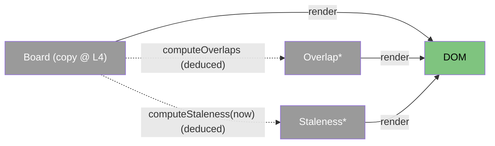

# viewer — categorical model

> Model-first (FRAMEWORK §2/§4). This is the static page served at `/v/<view>`, running in the viewer's browser (L4).

## 1. Overview
A desktop-primary, mobile-friendly page (Q4).
- It shows **Today** and **Tomorrow** stacked on one page, with no tabs (R2.3).
- Each day has a two-lane timeline, one lane per person; room bookings span both lanes. A detail list follows.
- It shows per-person "pushed HH:MM (X min ago)", an **unverified** badge (R4.3) and overlap badges (R3.3).
- It polls `/api/<view>/board` every 5 s while visible and stops when hidden (R4.2).
- It loads no third-party resources.
- A header control (**Auto · Light · Dark**) picks the colour theme. Auto follows the OS; the choice is kept per browser in `localStorage` and is not part of the `Board`.

## 2. Why
The page is a pure functor from `Board` to the DOM, plus the two deductions from domain. Holding no state beyond
the last `Board` means a re-render can never disagree with the server.

## 3. Core category

## 4. Morphism table
| Morphism | Signature | Partiality | Semantics |
| --- | --- | --- | --- |
| `poll ⊸` | `Visibility → Board` | Partial | fetches T3 every 5 s while `document.visibilityState = visible`; fetches immediately on becoming visible |
| `computeOverlaps` | `Board → Overlap*` | Deduced | domain |
| `computeStaleness` | `Board × Now → Staleness*` | Deduced | domain; also recomputed on a 30 s tick so badges appear without a new push |
| `render ⊸` | `Board × Overlap* × Staleness* → DOM` | Total | SGT times (C4); cancelled bookings are struck through (C3) |
| `daySplit` | `Booking* → {today, tomorrow}` | Deduced | by SGT calendar date of `start`; an empty day shows "No bookings" |
| `setTheme ⊸` | `ThemeChoice → DOM` | Partial | sets or removes `<html data-theme>` and persists the choice in `localStorage` (per browser, not part of `Board`); partial because storage may be unavailable, in which case the choice lasts only for the page view |

## 6. Composition rules
1. `invariant`: the rendered state is a function of (last `Board`, `now`) only.
2. `constraint`: no third-party requests. `<meta name="robots" content="noindex">` is present.
3. `constraint`: a `?pushed=<id>` query shows a "pushed ✓" toast, then is removed from the URL with `history.replaceState`.
4. `invariant`: the theme choice never enters the render function. Colour is CSS only (`data-theme` plus one token set per theme), so `render(board, now)` stays pure.

## 7. Atoms owned
**Trn**: `poll`, `render`, `daySplit`, `setTheme`.
**Loc**: L4.
**Trm**: it consumes `T3`.
**Placements**: `computeOverlaps` and `computeStaleness` are placed here.

## 9. Coherence notes
Law 1: everything rendered arrives in `Board` via T3, and `now` comes from the local clock as an explicit input.
